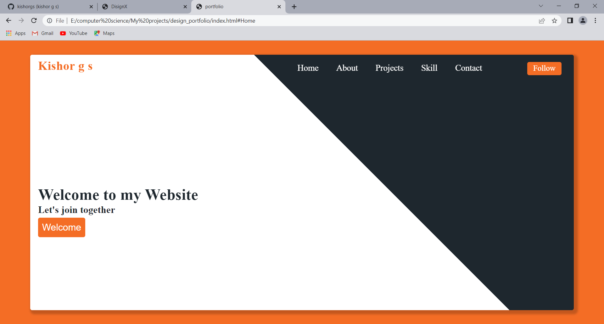
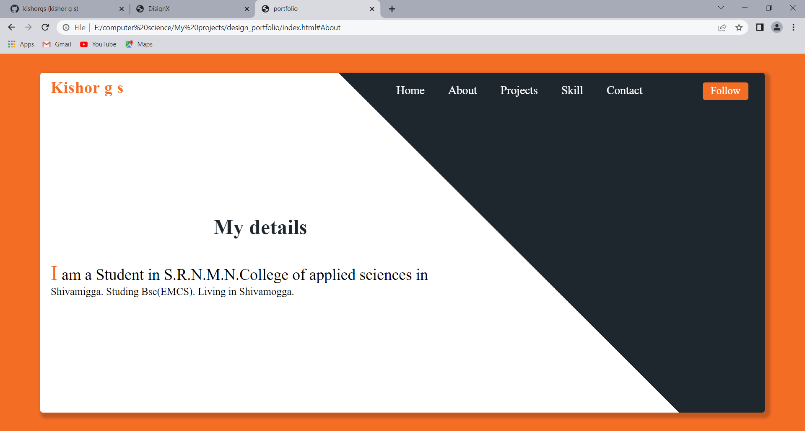
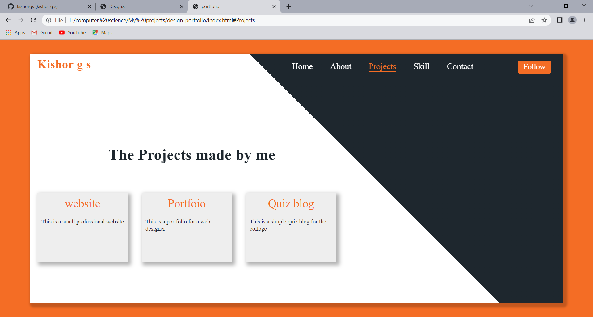
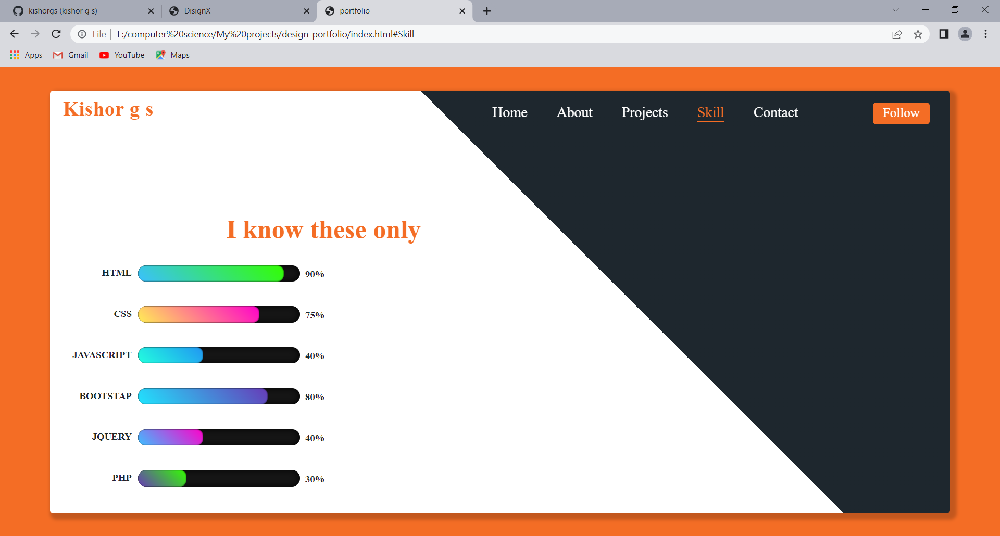
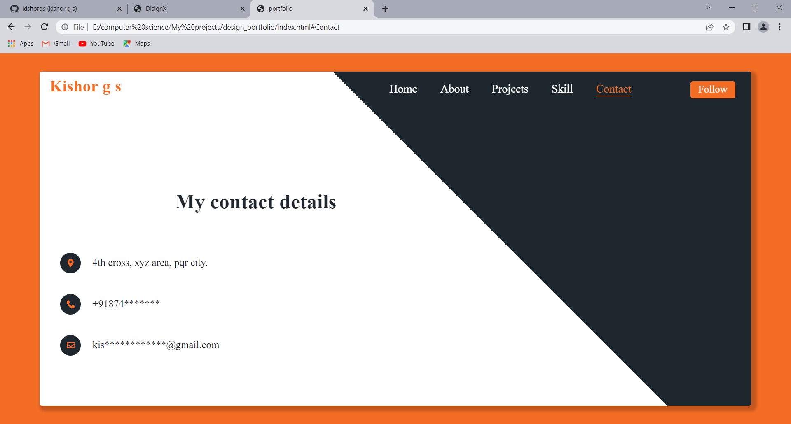
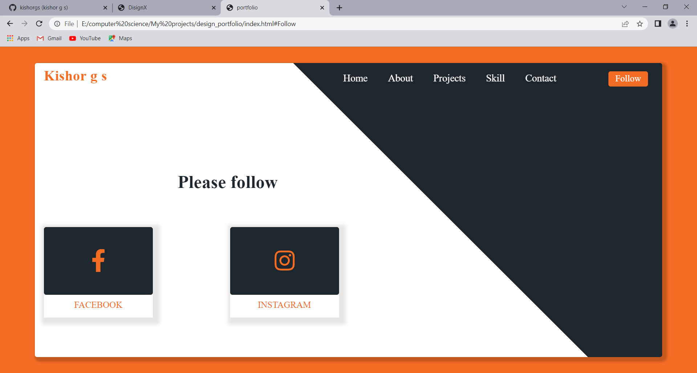

# simple-portfolio
**This is a simple portfolio website developed using HTML and CSS**

**The screenshots of the above project is provided below**

**This is Landing page of the website**

**This is about page of the website**

**This is projects page of the website**

**This is skill page of the website**

**This is contact page of the website**

**This is social media page of the website**

**This is just a simple website which is not responsive**
